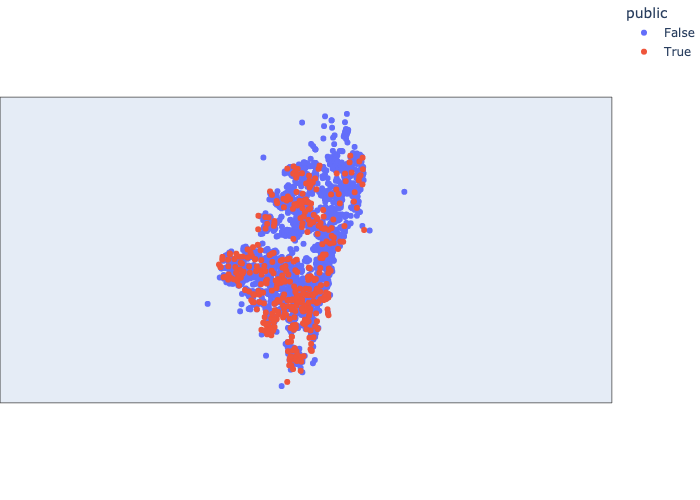
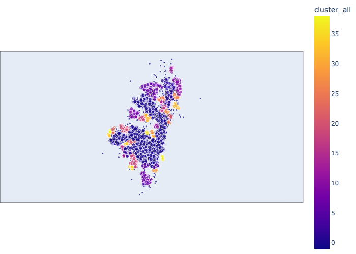
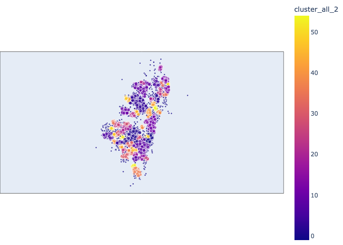
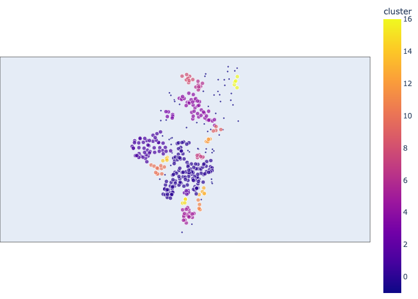
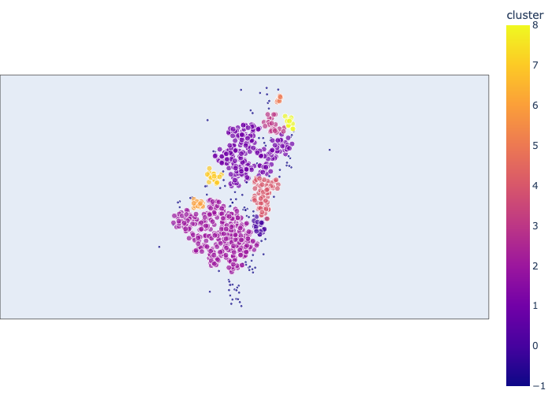
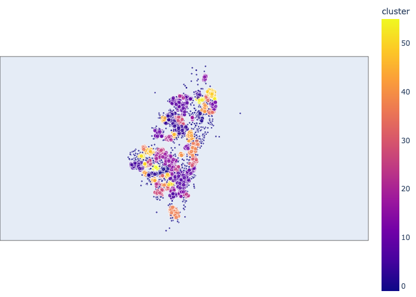
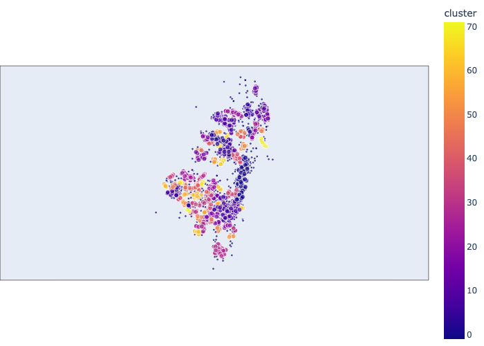

# School coverage analysis for Bogotá

The purpose of this project is to do an exploration of the school coverage in Bogotá using official information from the education ministry. The used dataset can be found in the open data page of the colombian government in the following <a href="https://www.datos.gov.co/Educaci-n/LISTADO-COLEGIOS-BOGOTA/qijw-htwa">link</a>. The dataset is a little outdated, as it has information from 2016, but the analysis should mostly hold as education coverage does not change rapidly.

## Imports


```python
import pandas as pd
import numpy as np
import geopandas as gpd
import pandas as pd
from googlemaps import Client as GoogleMaps
import googlemaps
import json
import plotly.express as px
from sklearn.cluster import DBSCAN
```


```python
%load_ext nb_black
```


## EDA and preprocessing


```python
school_data = pd.read_csv('../data/LISTADO_COLEGIOS_BOGOTA.csv')
```


```python
for c in school_data.columns:
    if len(school_data[c].unique()) < 2:
        print(f'Column {c} dropped for only having one value')
        school_data.drop(c, axis=1, inplace=True)
```

    Column año dropped for only having one value
    Column secretaria dropped for only having one value
    Column sector dropped for only having one value
    Column genero dropped for only having one value
    Column caracter dropped for only having one value
    Column estado dropped for only having one value
    Column internado dropped for only having one value


```python
school_data.head()
```


<div>
<style scoped>
    .dataframe tbody tr th:only-of-type {
        vertical-align: middle;
    }

    .dataframe tbody tr th {
        vertical-align: top;
    }

    .dataframe thead th {
        text-align: right;
    }
</style>
<table border="1" class="dataframe">
  <thead>
    <tr style="text-align: right;">
      <th></th>
      <th>nombreestablecimiento</th>
      <th>zona</th>
      <th>direccion</th>
      <th>telefono</th>
      <th>nombre_Rector</th>
      <th>tipo_Establecimiento</th>
      <th>etnias</th>
      <th>niveles</th>
      <th>jornadas</th>
      <th>especialidad</th>
      <th>...</th>
      <th>discapacidades</th>
      <th>idiomas</th>
      <th>numero_de_Sedes</th>
      <th>prestador_de_Servicio</th>
      <th>propiedad_Planta_Fisica</th>
      <th>resguardo</th>
      <th>matricula_Contratada</th>
      <th>calendario</th>
      <th>estrato_Socio_Economico</th>
      <th>correo_Electronico</th>
    </tr>
  </thead>
  <tbody>
    <tr>
      <th>0</th>
      <td>INST DE BTO TEC COMERCIAL PITAGORAS           ...</td>
      <td>URBANA</td>
      <td>KR 5 11 67</td>
      <td>5665677   / 3429092</td>
      <td>YOLANDA ARIAS CRUZ</td>
      <td>INSTITUCION EDUCATIVA</td>
      <td>NaN</td>
      <td>MEDIA,BÁSICA SECUNDARIA</td>
      <td>COMPLETA</td>
      <td>COMERCIAL,ACADÉMICA</td>
      <td>...</td>
      <td>NaN</td>
      <td>INGLÉS</td>
      <td>1</td>
      <td>PERSONA NATURAL</td>
      <td>PERSONA NATURAL</td>
      <td>NO APLICA</td>
      <td>NO</td>
      <td>A</td>
      <td>NaN</td>
      <td>pitagoras@pitagoras.edu.co</td>
    </tr>
    <tr>
      <th>1</th>
      <td>GIMNASIO INFANTIL FEDERICO FROEBEL</td>
      <td>URBANA</td>
      <td>CL 32 SUR 52 A 54</td>
      <td>7100349</td>
      <td>SANDRA MILENA MENDEZ</td>
      <td>CENTRO EDUCATIVO</td>
      <td>NaN</td>
      <td>PREESCOLAR</td>
      <td>COMPLETA</td>
      <td>NaN</td>
      <td>...</td>
      <td>NaN</td>
      <td>NaN</td>
      <td>1</td>
      <td>PERSONA NATURAL</td>
      <td>PERSONA NATURAL</td>
      <td>NO APLICA</td>
      <td>NO</td>
      <td>A</td>
      <td>NaN</td>
      <td>gimfedebel@hotmail.com</td>
    </tr>
    <tr>
      <th>2</th>
      <td>GIMNASIO INFANTIL LOS NIÑOS DEL MAÑANA</td>
      <td>URBANA</td>
      <td>CL 134 D 47 27</td>
      <td>6010350</td>
      <td>CLAUDIA BOCACHICA SAENZ</td>
      <td>INSTITUCION EDUCATIVA</td>
      <td>NaN</td>
      <td>PREESCOLAR,BÁSICA SECUNDARIA,BÁSICA PRIMARIA</td>
      <td>COMPLETA</td>
      <td>NaN</td>
      <td>...</td>
      <td>NaN</td>
      <td>NaN</td>
      <td>1</td>
      <td>PERSONA NATURAL</td>
      <td>PERSONA NATURAL</td>
      <td>NO APLICA</td>
      <td>NO</td>
      <td>A</td>
      <td>NaN</td>
      <td>claudialindenibocachica@hotmail.com</td>
    </tr>
    <tr>
      <th>3</th>
      <td>COLEGIO FRANCISCO PRIMERO S.S. (IED)</td>
      <td>URBANA</td>
      <td>KR 28 63 64</td>
      <td>2126019 -- 2481271</td>
      <td>JOSE CUSTODIO GALARZA MORENO</td>
      <td>INSTITUCION EDUCATIVA</td>
      <td>NaN</td>
      <td>PREESCOLAR,MEDIA,BÁSICA SECUNDARIA,BÁSICA PRIM...</td>
      <td>MAÑANA,ÚNICA,TARDE</td>
      <td>ACADÉMICA</td>
      <td>...</td>
      <td>NaN</td>
      <td>NaN</td>
      <td>4</td>
      <td>OFICIAL</td>
      <td>OFICIAL</td>
      <td>NO APLICA</td>
      <td>NO</td>
      <td>A</td>
      <td>NaN</td>
      <td>cedalemania12@redp.edu.co</td>
    </tr>
    <tr>
      <th>4</th>
      <td>COL SAN JUAN VIANETH                          ...</td>
      <td>URBANA</td>
      <td>KR 2 C 3 18 SUR</td>
      <td>2804738 -- 4714934</td>
      <td>GLORIA ESPERANZA CHUQUIN LAISECA</td>
      <td>CENTRO EDUCATIVO</td>
      <td>NaN</td>
      <td>PREESCOLAR,BÁSICA PRIMARIA</td>
      <td>MAÑANA,COMPLETA</td>
      <td>NaN</td>
      <td>...</td>
      <td>NaN</td>
      <td>INGLÉS</td>
      <td>1</td>
      <td>PERSONA NATURAL</td>
      <td>PERSONA NATURAL</td>
      <td>NO APLICA</td>
      <td>NO</td>
      <td>A</td>
      <td>NaN</td>
      <td>colegiosanjuanviateh@hotmail.com -- colegiosan...</td>
    </tr>
  </tbody>
</table>
<p>5 rows × 23 columns</p>
</div>


```python
school_data.iloc[0]
```


    nombreestablecimiento        INST DE BTO TEC COMERCIAL PITAGORAS           ...
    zona                                                                    URBANA
    direccion                                                           KR 5 11 67
    telefono                                                   5665677   / 3429092
    nombre_Rector                                               YOLANDA ARIAS CRUZ
    tipo_Establecimiento                                     INSTITUCION EDUCATIVA
    etnias                                                                     NaN
    niveles                                                MEDIA,BÁSICA SECUNDARIA
    jornadas                                                              COMPLETA
    especialidad                                               COMERCIAL,ACADÉMICA
    grados                                                           6,7,8,9,10,11
    modelos_Educativos                                       EDUCACIÓN TRADICIONAL
    capacidades_Excepcionales                                                  NaN
    discapacidades                                                             NaN
    idiomas                                                                 INGLÉS
    numero_de_Sedes                                                              1
    prestador_de_Servicio                                          PERSONA NATURAL
    propiedad_Planta_Fisica                                        PERSONA NATURAL
    resguardo                                                            NO APLICA
    matricula_Contratada                                                        NO
    calendario                                                                   A
    estrato_Socio_Economico                                                    NaN
    correo_Electronico                                  pitagoras@pitagoras.edu.co
    Name: 0, dtype: object


We are not interested in information about the name, telephone number, ethnic status, schedulle type, especiality, and other attributes of the schools, so this columns are als dropped.


```python
school_data.drop(['telefono', 'especialidad', 'grados', 'modelos_Educativos','etnias',
       'capacidades_Excepcionales', 'discapacidades', 'numero_de_Sedes','propiedad_Planta_Fisica',
       'resguardo', 'matricula_Contratada', 'calendario','nombre_Rector','tipo_Establecimiento',
       'estrato_Socio_Economico', 'correo_Electronico','jornadas'], axis = 1, inplace=True)
```


```python
school_data.head()
```


<div>
<style scoped>
    .dataframe tbody tr th:only-of-type {
        vertical-align: middle;
    }

    .dataframe tbody tr th {
        vertical-align: top;
    }

    .dataframe thead th {
        text-align: right;
    }
</style>
<table border="1" class="dataframe">
  <thead>
    <tr style="text-align: right;">
      <th></th>
      <th>nombreestablecimiento</th>
      <th>zona</th>
      <th>direccion</th>
      <th>niveles</th>
      <th>idiomas</th>
      <th>prestador_de_Servicio</th>
    </tr>
  </thead>
  <tbody>
    <tr>
      <th>0</th>
      <td>INST DE BTO TEC COMERCIAL PITAGORAS           ...</td>
      <td>URBANA</td>
      <td>KR 5 11 67</td>
      <td>MEDIA,BÁSICA SECUNDARIA</td>
      <td>INGLÉS</td>
      <td>PERSONA NATURAL</td>
    </tr>
    <tr>
      <th>1</th>
      <td>GIMNASIO INFANTIL FEDERICO FROEBEL</td>
      <td>URBANA</td>
      <td>CL 32 SUR 52 A 54</td>
      <td>PREESCOLAR</td>
      <td>NaN</td>
      <td>PERSONA NATURAL</td>
    </tr>
    <tr>
      <th>2</th>
      <td>GIMNASIO INFANTIL LOS NIÑOS DEL MAÑANA</td>
      <td>URBANA</td>
      <td>CL 134 D 47 27</td>
      <td>PREESCOLAR,BÁSICA SECUNDARIA,BÁSICA PRIMARIA</td>
      <td>NaN</td>
      <td>PERSONA NATURAL</td>
    </tr>
    <tr>
      <th>3</th>
      <td>COLEGIO FRANCISCO PRIMERO S.S. (IED)</td>
      <td>URBANA</td>
      <td>KR 28 63 64</td>
      <td>PREESCOLAR,MEDIA,BÁSICA SECUNDARIA,BÁSICA PRIM...</td>
      <td>NaN</td>
      <td>OFICIAL</td>
    </tr>
    <tr>
      <th>4</th>
      <td>COL SAN JUAN VIANETH                          ...</td>
      <td>URBANA</td>
      <td>KR 2 C 3 18 SUR</td>
      <td>PREESCOLAR,BÁSICA PRIMARIA</td>
      <td>INGLÉS</td>
      <td>PERSONA NATURAL</td>
    </tr>
  </tbody>
</table>
</div>


Now that we have filtered all the attributes of interest let's explore each column and translate its meaning to english.


```python
school_data['zona'].unique()
```


    array(['URBANA', 'RURAL', 'RURAL,URBANA'], dtype=object)


The attribute zona classifies the location of the school between urban and rural. For this particular analysis we are only interested in the urban area of Bogotá, so let's retain only those institutions.


```python
school_data = school_data[school_data['zona'] == 'URBANA'].drop('zona', axis=1)
```


The niveles feature presents the educatinal levels available at the different schoools. The next code cell presents the translation of the different levels and process the column into one binary attribute for each level.


```python
school_data['niveles'] = school_data['niveles'].apply(lambda x: [] if pd.isna(x) else x.split(','))
set(np.concatenate(school_data['niveles'].values))
```


    {'BÁSICA PRIMARIA',
     'BÁSICA SECUNDARIA',
     'MEDIA',
     'PREESCOLAR',
     'PRIMERA INFANCIA'}


```python
dic_translate_level = {
    'BÁSICA PRIMARIA': 'Primary',
    'BÁSICA SECUNDARIA': 'Secondary',
    'MEDIA': 'Middle',
    'PREESCOLAR': 'Preschool',
    'PRIMERA INFANCIA': 'Childcare'
}
for k,v in dic_translate_level.items():
    school_data[v] = school_data['niveles'].apply(lambda x: k in x)
school_data.drop('niveles',axis=1,inplace=True)
```


The idiomas attribute has information about the languages different from spanish taught in the educational institutes. From this attribute let's create another one that encode if the school is bilingual or not.


```python
school_data['bilingual'] = ~school_data['idiomas'].isna()
school_data.drop('idiomas', axis=1, inplace=True)
```


Finally from the prestador_de_Servicio attribute we are going to extract if the school is public or private and save it on a feature named public.


```python
school_data['public'] = school_data['prestador_de_Servicio'] == 'OFICIAL'
school_data.drop('prestador_de_Servicio', axis=1, inplace=True)
```


Now that we processed attributes of interest let's explore the resulting data frame.


```python
school_data.drop('direccion',axis=1).mean()
```

    /var/folders/sy/55_grszs60j_67x7hfzqk8800000gn/T/ipykernel_16068/1850020645.py:1: FutureWarning: Dropping of nuisance columns in DataFrame reductions (with 'numeric_only=None') is deprecated; in a future version this will raise TypeError.  Select only valid columns before calling the reduction.
      school_data.drop('direccion',axis=1).mean()


    Primary      0.760759
    Secondary    0.582278
    Middle       0.546835
    Preschool    0.886498
    Childcare    0.002110
    bilingual    0.395781
    public       0.160759
    dtype: float64


The most common schools are preschools and primary schools, while the number of institutions that serve as childcare for babies is relatively small.


```python
np.corrcoef(school_data['bilingual'],school_data['public'])[0,1]
```


    -0.354221572326856


There is a negative correlation between the instruction of a second language and the attribute that tells if the school is public. In other words, public schools are less likely to be bilingual.

## Geocoding

In order to do the coverage analysis we require to convert the addresses to geocodified location with latitude and longitude. To do this we are going to use the google maps api. In order to run the notebook you need to generate a api key and save it in keys.json under the key maps_key.


```python
vc_address = school_data['direccion'].value_counts()
```


As the following table shows, there are 49 schools that share their address with another one. After some exploration it was found that some of these addresses were wrong. Because the number of schools for which the incorrect address is small, a manual correction was done for these 49 shools.


```python
school_data[school_data['direccion'].isin(vc_address[vc_address>1].index)].sort_values('direccion')[
    ['nombreestablecimiento','direccion']
].head(10)
```


<div>
<style scoped>
    .dataframe tbody tr th:only-of-type {
        vertical-align: middle;
    }

    .dataframe tbody tr th {
        vertical-align: top;
    }

    .dataframe thead th {
        text-align: right;
    }
</style>
<table border="1" class="dataframe">
  <thead>
    <tr style="text-align: right;">
      <th></th>
      <th>nombreestablecimiento</th>
      <th>direccion</th>
    </tr>
  </thead>
  <tbody>
    <tr>
      <th>517</th>
      <td>COLEGIO LA TOSCANA - LISBOA (IED)</td>
      <td>CL 132 D 132 05</td>
    </tr>
    <tr>
      <th>687</th>
      <td>COLEGIO GONZALO ARANGO (IED)</td>
      <td>CL 132 D 132 05</td>
    </tr>
    <tr>
      <th>26</th>
      <td>COLEGIO INTEGRADO EDUARDO CABALLERO CALDERON</td>
      <td>CL 132 D BIS 132 08</td>
    </tr>
    <tr>
      <th>1004</th>
      <td>COLEGIO SUPERIOR DE PALERMO</td>
      <td>CL 132 D BIS 132 08</td>
    </tr>
    <tr>
      <th>1507</th>
      <td>INST CULT RAFAEL MAYA                         ...</td>
      <td>CL 134 A 147 C 07</td>
    </tr>
    <tr>
      <th>2244</th>
      <td>CENTRO JOHANN KEPLER</td>
      <td>CL 134 A 147 C 07</td>
    </tr>
    <tr>
      <th>1966</th>
      <td>COL CIAL VILLA MARIA                          ...</td>
      <td>CL 139 A 111 04</td>
    </tr>
    <tr>
      <th>220</th>
      <td>CENT DE EDUC DE ADULTOS CULTURAL</td>
      <td>CL 139 A 111 04</td>
    </tr>
    <tr>
      <th>1464</th>
      <td>FUNDACIÓN DE EDUCACION EDUARDO ESCOVAR GONZALE...</td>
      <td>CL 146 A 94 D 19</td>
    </tr>
    <tr>
      <th>1045</th>
      <td>CENT PANAMERICANO DE CAPACITACION SEDE SUBA   ...</td>
      <td>CL 146 A 94 D 19</td>
    </tr>
  </tbody>
</table>
</div>


```python
school_data[school_data['direccion'].isin(vc_address[vc_address>1].index)].sort_values('direccion')[
    ['nombreestablecimiento','direccion']
].to_csv('../data/repeated_addresses.csv')
```


```python
repeated_address_depuration = pd.read_csv('../data/repeated_addresses_corrected.csv',index_col=0)
```


```python
school_data = pd.merge(
    school_data,
    repeated_address_depuration.drop(['direccion','nombreestablecimiento'],axis=1),
    left_index=True,
    right_index=True,
    how='left'
)
```


```python
school_data = school_data[school_data['delete']!=1].drop('delete',axis=1).copy()
```


```python
school_data['direccion'] = school_data.apply(
    lambda row: row['direccion'] if pd.isna(row['corrected_address']) else row['corrected_address'],
    axis=1
)
```


```python
with open('../keys.json','r') as f:
    maps_key = json.load(f)['maps_key']
```


```python
gmaps_client = googlemaps.Client(key=maps_key)
```


```python
address_dic = {}
for address in school_data['direccion']:
    try:
        address_dic[address] = gmaps_client.geocode(address + ', Bogota, Colombia')[0]['geometry']['location']
    except:
        print(f'Request failed {address}')
```

    Request failed CL 54 A 27 39 SUR


Let's retry the geocoding for the addresses that failed


```python
for address in school_data['direccion']:
    if address not in address_dic.keys():
        try:
            address_dic[address] = gmaps_client.geocode(address + ', Bogota, Colombia')[0]['geometry']['location']
        except:
            print(f'Request failed {address}')
```


Now we can convert the addresses into latitude and longitude values


```python
school_data['lat'] = school_data['direccion'].apply(lambda x: address_dic[x]['lat'])
school_data['lon'] = school_data['direccion'].apply(lambda x: address_dic[x]['lng'])
```


```python
school_data.drop(['direccion','corrected_address'],axis=1,inplace=True)
```


Now that we have a processed dataset with categories and coordinate locations for each school, let's plot a map of the different institutions.


```python
# school_data.to_csv('../data/school_data_processed.csv')
school_data = pd.read_csv("../data/school_data_processed.csv", index_col=0)
```


```python
with open("../keys.json", "r") as f:
    mapbox_key = json.load(f)["mapbox"]
```


```python
school_data_gpd = gpd.GeoDataFrame(
    school_data.drop(["lat", "lon"], axis=1),
    geometry=gpd.points_from_xy(school_data["lon"], school_data["lat"]),
)
```


```python
school_data_gpd
```


<div>
<style scoped>
    .dataframe tbody tr th:only-of-type {
        vertical-align: middle;
    }

    .dataframe tbody tr th {
        vertical-align: top;
    }

    .dataframe thead th {
        text-align: right;
    }
</style>
<table border="1" class="dataframe">
  <thead>
    <tr style="text-align: right;">
      <th></th>
      <th>nombreestablecimiento</th>
      <th>Primary</th>
      <th>Secondary</th>
      <th>Middle</th>
      <th>Preschool</th>
      <th>Childcare</th>
      <th>bilingual</th>
      <th>public</th>
      <th>geometry</th>
    </tr>
  </thead>
  <tbody>
    <tr>
      <th>0</th>
      <td>INST DE BTO TEC COMERCIAL PITAGORAS           ...</td>
      <td>False</td>
      <td>True</td>
      <td>True</td>
      <td>False</td>
      <td>False</td>
      <td>True</td>
      <td>False</td>
      <td>POINT (-74.07331 4.59777)</td>
    </tr>
    <tr>
      <th>1</th>
      <td>GIMNASIO INFANTIL FEDERICO FROEBEL</td>
      <td>False</td>
      <td>False</td>
      <td>False</td>
      <td>True</td>
      <td>False</td>
      <td>False</td>
      <td>False</td>
      <td>POINT (-74.12871 4.60508)</td>
    </tr>
    <tr>
      <th>2</th>
      <td>GIMNASIO INFANTIL LOS NIÑOS DEL MAÑANA</td>
      <td>True</td>
      <td>True</td>
      <td>False</td>
      <td>True</td>
      <td>False</td>
      <td>False</td>
      <td>False</td>
      <td>POINT (-74.05455 4.72102)</td>
    </tr>
    <tr>
      <th>3</th>
      <td>COLEGIO FRANCISCO PRIMERO S.S. (IED)</td>
      <td>True</td>
      <td>True</td>
      <td>True</td>
      <td>True</td>
      <td>False</td>
      <td>False</td>
      <td>True</td>
      <td>POINT (-74.07563 4.65213)</td>
    </tr>
    <tr>
      <th>4</th>
      <td>COL SAN JUAN VIANETH                          ...</td>
      <td>True</td>
      <td>False</td>
      <td>False</td>
      <td>True</td>
      <td>False</td>
      <td>True</td>
      <td>False</td>
      <td>POINT (-74.06367 4.61694)</td>
    </tr>
    <tr>
      <th>...</th>
      <td>...</td>
      <td>...</td>
      <td>...</td>
      <td>...</td>
      <td>...</td>
      <td>...</td>
      <td>...</td>
      <td>...</td>
      <td>...</td>
    </tr>
    <tr>
      <th>2399</th>
      <td>COLEGIO SAN JOSE DE CALASANZ</td>
      <td>True</td>
      <td>True</td>
      <td>True</td>
      <td>True</td>
      <td>False</td>
      <td>False</td>
      <td>False</td>
      <td>POINT (-74.08836 4.72321)</td>
    </tr>
    <tr>
      <th>2400</th>
      <td>COL NUEVO REINO DE TURINGIA</td>
      <td>True</td>
      <td>False</td>
      <td>False</td>
      <td>True</td>
      <td>False</td>
      <td>True</td>
      <td>False</td>
      <td>POINT (-74.09132 4.75305)</td>
    </tr>
    <tr>
      <th>2401</th>
      <td>LIC  INF GOOFY                                ...</td>
      <td>True</td>
      <td>False</td>
      <td>False</td>
      <td>True</td>
      <td>False</td>
      <td>True</td>
      <td>False</td>
      <td>POINT (-74.18504 4.60156)</td>
    </tr>
    <tr>
      <th>2402</th>
      <td>LIC APRENDO CON MIS AMIGOS                    ...</td>
      <td>True</td>
      <td>False</td>
      <td>False</td>
      <td>True</td>
      <td>False</td>
      <td>True</td>
      <td>False</td>
      <td>POINT (-74.13807 4.67083)</td>
    </tr>
    <tr>
      <th>2403</th>
      <td>JARD INF EL ROSAL DE MI INFANCIA              ...</td>
      <td>True</td>
      <td>False</td>
      <td>False</td>
      <td>True</td>
      <td>False</td>
      <td>True</td>
      <td>False</td>
      <td>POINT (-74.10173 4.58511)</td>
    </tr>
  </tbody>
</table>
<p>2355 rows × 9 columns</p>
</div>


```python
px.set_mapbox_access_token(mapbox_key)
fig = px.scatter_geo(
    school_data_gpd,
    lat=school_data_gpd.geometry.y,
    lon=school_data_gpd.geometry.x,
    hover_name="nombreestablecimiento",
    color="public",
)
fig.update_geos(fitbounds="locations")
fig.update_layout(
    mapbox_style="open-street-maps",
    margin={"r": 0, "t": 0, "l": 0, "b": 0},
    mapbox_accesstoken=mapbox_key,
)
fig.show()
fig.write_image("../maps/map1.png")
```




From the map above it can be observed a greater concentration of public schools in the south of the city which correlates with the poorest zones of Bogotá.

## Coverage

In order to explore the coverage we are going to use the DBscan algorithm. This density based clustering algorithm is based on two parameters $\epsilon$ and n_points which jointly define the necesary density for a cluster. DBScan identifies the points that have at least n_points closer than $\epsilon$ and clasify them as core points. Every core point with its $\epsilon$ neighbors form a cluster which is then extended by the neighbors of other core points inside the cluster. For more information about this algorithm can be found in the sklearn <a href="https://scikit-learn.org/stable/modules/generated/sklearn.cluster.DBSCAN.html">documentation</a>.

In order to apply the algorithm we have to project the geospatial data and define $\epsilon$ and n_features. Considering that the school locations are all in Bogotá, and that Colombia is a ecuatorial country (if not longitude meassures would be greatly distorted), we can safely do the naive projection of lat and lon into the plane. Let's now do a first analysis requiring at least 4 schools in a radius of 500 meters in order to be considered a core point


```python
db_pred = DBSCAN(eps=1 / (111.1 * 2), min_samples=4).fit_predict(
    school_data[["lat", "lon"]]
)
```


```python
school_data_gpd["cluster_all"] = db_pred
```


```python
def plot_dbscan(col, school_data_gpd=school_data_gpd, save_img="../maps/map.png"):
    school_data_gpd["member"] = (school_data_gpd[col] >= 0).apply(
        lambda x: 1 if x else 0.3
    )
    px.set_mapbox_access_token(mapbox_key)
    fig = px.scatter_geo(
        school_data_gpd,
        lat=school_data_gpd.geometry.y,
        lon=school_data_gpd.geometry.x,
        hover_name="nombreestablecimiento",
        color=col,
        size="member",
        size_max=5,
    )
    fig.update_geos(fitbounds="locations")
    fig.update_layout(
        mapbox_style="open-street-maps",
        margin={"r": 0, "t": 0, "l": 0, "b": 0},
        mapbox_accesstoken=mapbox_key,
    )
    fig.show()
    fig.write_image(save_img)
```


```python
plot_dbscan("cluster_all", school_data_gpd, "../maps/map2.png")
```




The first map shows that there is a low concentration of schools as expected in natural resources like the suba wetlands and hill, and in the undeveloped parts of Usme. The map also shows that there is also low school coverage in Usaquen and in the industrial zone around Cra 13. Let strengthen the coverage requirements by asking for at least 8 schools in a 500 m radius.


```python
school_data_gpd["cluster_all_2"] = DBSCAN(
    eps=1 / (111.1 * 2), min_samples=8
).fit_predict(school_data[["lat", "lon"]])
```


```python
plot_dbscan("cluster_all_2", save_img="../maps/map3.png")
```




By increasing the density requirements new problematic areas arise like Kennedy in the south west of the city and the east of Suba. Now let's complement the analysis by considering some subsets of the schools.

### Public schools


```python
school_data_gpd_analysis = school_data_gpd[school_data_gpd["public"]].copy()
school_data_analysis = school_data[school_data["public"]].copy()
```


```python
school_data_gpd_analysis["cluster"] = DBSCAN(
    eps=1 / (111.1), min_samples=4
).fit_predict(school_data_analysis[["lat", "lon"]])
```


```python
plot_dbscan("cluster", school_data_gpd_analysis, save_img="../maps/map4.png")
```




When considering only public schools we can see that there is a lack of coverage in the north and west of the city. The low density in the north of the city can be explained by the greater income of citizens in such zone and the preference for private schools, but the lack of public institutions around Cra 26  and Cra 13 is problematic and should be explored further.

### Bilingual schools


```python
school_data_gpd_analysis = school_data_gpd[school_data_gpd["bilingual"]].copy()
school_data_analysis = school_data[school_data["bilingual"]].copy()
```


```python
school_data_gpd_analysis["cluster"] = DBSCAN(
    eps=1 / (111.1), min_samples=8
).fit_predict(school_data_analysis[["lat", "lon"]])
```


```python
plot_dbscan("cluster", school_data_gpd_analysis, save_img="../maps/map5.png")
```




The density of bilingual schools is similar to the density of all schools as shown in the map above with an important difference in Usme where there is low concentration of these type of schools.

### Preschools


```python
school_data_gpd_analysis = school_data_gpd[school_data_gpd["Preschool"]].copy()
school_data_analysis = school_data[school_data["Preschool"]].copy()
```


```python
school_data_gpd_analysis["cluster"] = DBSCAN(
    eps=1 / (111.1 * 2), min_samples=8
).fit_predict(school_data_analysis[["lat", "lon"]])
```


```python
plot_dbscan("cluster", school_data_gpd_analysis, save_img="../maps/map6.png")
```




The dbscan result for preschools is similar to the result for all schools, but shos an important difference in Chapinero and Usaquen where the density is very low in relation to the rest of the city.

### Secondary schools


```python
school_data_gpd_analysis = school_data_gpd[school_data_gpd["Secondary"]].copy()
school_data_analysis = school_data[school_data["Secondary"]].copy()
```


```python
school_data_gpd_analysis["cluster"] = DBSCAN(
    eps=1 / (111.1 * 2), min_samples=4
).fit_predict(school_data_analysis[["lat", "lon"]])
```


```python
plot_dbscan("cluster", school_data_gpd_analysis, save_img="../maps/map7.png")
```




There are much less secondary schools in Bogotá than preschools. The deficit of this type of schools is bigger in the industrial zone and the north of the city.

## Conclusions

Using the dbscan algorithm we found that the industrial zone of Bogotá and Usaquen have low educational coverage in relation with the rest of the city. The analysis also showed that public schools are concentrated in the south of the city and there is a lack of bilingual schools in that area.

A little detail that would help greatly for map interpretation is to include a basemap with information about the city. Also, in order to improve the analysis we should correlate our findings with the population density in Bogotá and consider the size of the different schools. 


```python

```
