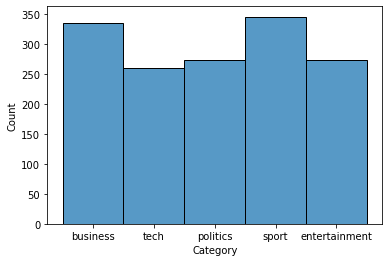
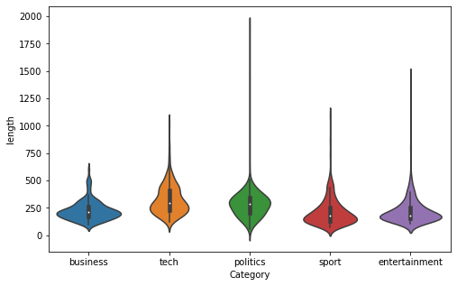
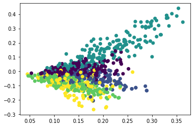
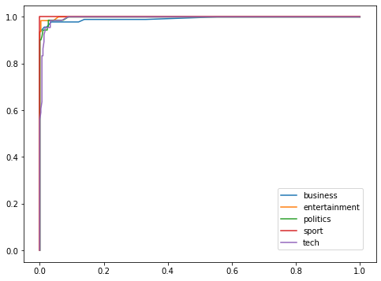
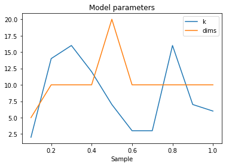
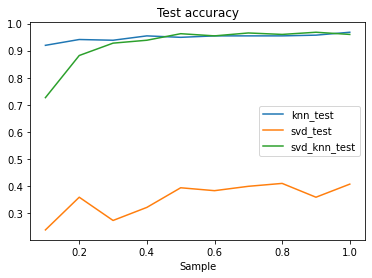
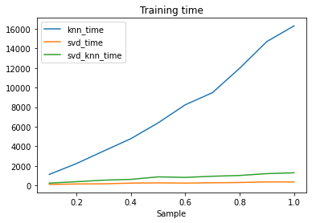
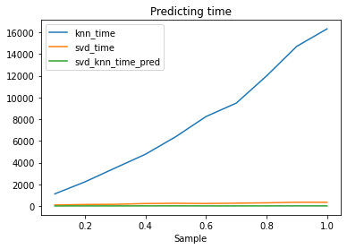
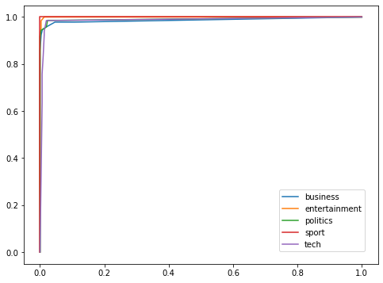

# BBC news clasification

## Project setup
```
conda create -n kaggle_bbc python==3.9
conda activate kaggle_bbc
conda install jupyter -y
conda install matplotlib -y
conda install seaborn -y
conda install nltk -y
conda install scikit-learn -y
```
Download data from <a href="https://www.kaggle.com/competitions/learn-ai-bbc/data">kaggle</a> and save it in the /KaggleBBC/Data/

## Matrix factorization

### Unsupervised Algorithms in Machine Learning

This notebook is part of the week 4 project of the course Unsupervised Algorithms in Machine Learning from the University of Colorado Boulder and tackles the BBC news classification competition from <a href="https://www.kaggle.com/competitions/learn-ai-bbc/data">kaggle</a> using matrix factorization for multiple tasks. <br>
The document is divided in the following sections:
* Introduction
* Exploratory Data Analysis and preprocessing
* Baseline model
* Matrix factorization
* Final model and submision
* Conclusions
* References

### Introduction

Imports


```python
import pandas as pd
import numpy as np
import matplotlib.pyplot as plt
import seaborn as sns
import nltk
import string
from sklearn.feature_extraction.text import TfidfVectorizer
from sklearn.decomposition import TruncatedSVD
from sklearn.model_selection import train_test_split
from sklearn.neighbors import KNeighborsClassifier
from sklearn.model_selection import GridSearchCV
from itertools import permutations
from sklearn.metrics import accuracy_score, roc_auc_score, roc_curve
import time
```


```python
# %load_ext nb_black
```


Data import


```python
train_loc = "/kaggle/input/learn-ai-bbc/BBC News Train.csv"
test_loc = "/kaggle/input/learn-ai-bbc/BBC News Test.csv"
```


In order to run this notebook locally uncomment the following cell, dowload the <a href="https://www.kaggle.com/competitions/learn-ai-bbc/data">data</a> from kaggle and save it in a folder named Data beside Notebooks.


```python
# train_loc = "../Data/BBC News Train.csv"
# test_loc = "../Data/BBC News Test.csv"
```


```python
train = pd.read_csv(train_loc)
test = pd.read_csv(test_loc)
```


Constants


```python
np.random.seed(42)
```


```python
N_NEIGH_LIST = list(range(2, 20)) + [
    22,
    25,
    27,
    30,
    35,
    40,
    50,
    75,
    100,
    150,
    200,
]
```


### Exploratory Data Analysis and preprocessing


```python
train.head()
```


<div>
<style scoped>
    .dataframe tbody tr th:only-of-type {
        vertical-align: middle;
    }

    .dataframe tbody tr th {
        vertical-align: top;
    }

    .dataframe thead th {
        text-align: right;
    }
</style>
<table border="1" class="dataframe">
  <thead>
    <tr style="text-align: right;">
      <th></th>
      <th>ArticleId</th>
      <th>Text</th>
      <th>Category</th>
    </tr>
  </thead>
  <tbody>
    <tr>
      <th>0</th>
      <td>1833</td>
      <td>worldcom ex-boss launches defence lawyers defe...</td>
      <td>business</td>
    </tr>
    <tr>
      <th>1</th>
      <td>154</td>
      <td>german business confidence slides german busin...</td>
      <td>business</td>
    </tr>
    <tr>
      <th>2</th>
      <td>1101</td>
      <td>bbc poll indicates economic gloom citizens in ...</td>
      <td>business</td>
    </tr>
    <tr>
      <th>3</th>
      <td>1976</td>
      <td>lifestyle  governs mobile choice  faster  bett...</td>
      <td>tech</td>
    </tr>
    <tr>
      <th>4</th>
      <td>917</td>
      <td>enron bosses in $168m payout eighteen former e...</td>
      <td>business</td>
    </tr>
  </tbody>
</table>
</div>


As we can see in the following plot the category labels are balanced.


```python
sns.histplot(train["Category"])
```


    <AxesSubplot:xlabel='Category', ylabel='Count'>


    

    


Text is a challenging data source for machine learning algorithms because of its complexity and lack of structure. The problem of converting text articles into numerical vectors so that classification models can be applied is very challenging and needs to be done in a way such that:
* Important information of the text is captured
* The codification is efficient (non relevant information is discarded)
* The resultant dimensionality is manageable
* Computation and memory consumption is not an issue

These challanges will be addressed by various preprocessing steps including standarization, puntuation and stopword removal, and the use of Term Frequency - Inverse Document Frequency vectorization.

Delete punctuation signs and transform into lowercase


```python
train["Text"] = train["Text"].apply(
    lambda x: "".join([s.lower() for s in x if s not in string.punctuation])
)
test["Text"] = test["Text"].apply(
    lambda x: "".join([s for s in x if s not in string.punctuation])
)
```


Tockenization


```python
train["Text"] = train["Text"].apply(lambda x: x.split(" "))
test["Text"] = test["Text"].apply(lambda x: x.split(" "))
```


Delete stopwords


```python
# nltk.download('stopwords')
```


```python
stopwords = nltk.corpus.stopwords.words("english")
```


```python
stopwords = ["".join([s for s in w if s not in string.punctuation]) for w in stopwords]
```


```python
train["Text"] = train["Text"].apply(lambda t: [w for w in t if w not in stopwords])
test["Text"] = test["Text"].apply(lambda t: [w for w in t if w not in stopwords])
```


Lenght of text attribute


```python
train["length"] = train["Text"].apply(len)
```


```python
test["length"] = test["Text"].apply(len)
```


```python
sns.violinplot(data=train, y="length", x="Category")
fig = plt.gcf()
fig.set_size_inches(8, 5)
```


    

    


```python
classes = train["Category"].unique()
```


Train and test split


```python
x_train, x_test, y_train, y_test = train_test_split(
    train.drop("Category", axis=1), train["Category"], test_size=0.25
)
```


The final step to prepare the articles for the machine learning algorithms is to use the TfIdf vectorization. This technique produces a vector $v=\lambda(v_1,v_2,\dots ,v_n)$ for each article where each entry attempts to represent the importance of a specific term in the text and is calculated according to the next formula (there are other similar definitions with subtle differences):
$$
v_i = TF*IDF = \text{Number of appereances of word }i*log\Big(\frac{\text{Number of documents}+1}{\text{Number of documents were word }i\text{ appears}+1}+1\Big)
$$
The left side of the multiplication is bigger as the prevalence of the word increases and the right side of the weights more heavily rare terms. Finally, the $\lambda$ parameter normalizes the vector to norm 1 so that all outputs have the same l2 length.


```python
vectorizer = TfidfVectorizer()
```


```python
x_train_vectorized = np.array(
    vectorizer.fit_transform(x_train["Text"].apply(lambda x: " ".join(x))).todense()
)
```


```python
x_test_vectorized = np.array(
    vectorizer.transform(x_test["Text"].apply(lambda x: " ".join(x))).todense()
)

```


```python
x_test_kaggle = np.array(
    vectorizer.transform(test["Text"].apply(lambda x: " ".join(x))).todense()
)

```


Now that we have a vectorized representation of the articles let's use matrix factorization for dimensionality reduction in order to visualize the different texts and their respective labels


```python
sklearn_svd = TruncatedSVD(n_components=2)
```


```python
x_train_2d = sklearn_svd.fit_transform(x_train_vectorized)
```


```python
fig, ax = plt.subplots()
ax.scatter(
    x_train_2d[:, 0],
    x_train_2d[:, 1],
    c=y_train.apply(lambda x: list(classes).index(x)),
)
```


    <matplotlib.collections.PathCollection at 0x7f795a3ace80>


    

    


The plot above shows a 2D representation of the articles and their labels, and exposes that there are considerable differences between the different classes.

### Baseline model

Now let's construct a baseline classification model using the K Nearest Neighbors algorithm.


```python
knn = KNeighborsClassifier()
```


```python
knn_gridcv = GridSearchCV(knn, param_grid={"n_neighbors": N_NEIGH_LIST},)
```


Cross validation


```python
knn_gridcv.fit(x_train_vectorized, y_train)
```


    GridSearchCV(estimator=KNeighborsClassifier(),
                 param_grid={'n_neighbors': [2, 3, 4, 5, 6, 7, 8, 9, 10, 11, 12, 13,
                                             14, 15, 16, 17, 18, 19, 22, 25, 27, 30,
                                             35, 40, 50, 75, 100, 150, 200]})


```python
knn = knn_gridcv.best_estimator_
knn_gridcv.best_estimator_
```


    KNeighborsClassifier(n_neighbors=40)


```python
knn_gridcv.best_score_
```


    0.9453955797565662


Test metrics


```python
y_test_pred = knn.predict(x_test_vectorized)
```


```python
y_test_pred_proba = knn.predict_proba(x_test_vectorized)
```


```python
accuracy_score(y_test, y_test_pred)
```


    0.967828418230563


The train and test accuracy, and the following ROC plots, reveal that the KNN model has strong predictive power and extrapolates well to unseen data.


```python
fig, ax = plt.subplots()
for i in range(len(knn.classes_)):
    fpr, tpr, _ = roc_curve(
        (y_test == knn.classes_[i]).astype(int), y_test_pred_proba[:, i]
    )
    ax.plot(fpr, tpr)
fig.legend(labels=knn.classes_, loc=4, bbox_to_anchor=(0.88, 0.15))
fig.set_size_inches(8, 6)
```


    

    


### Non negative matrix factorization

The course assignment requires to test matrix factorization as an unsupervised approach for the classification problem, so the TruncatedSVD class of sklearn will be used to extract 5 features from the texts. Every data instance is then assigned to feature of greater value and then, each of these 5 features will be assigned to a data label by maximizing the accuracy on the training set over all feature permutations. 


```python
sklearn_svd = TruncatedSVD(n_components=5)
```


```python
pred_train_svd = np.argmax(sklearn_svd.fit_transform(x_train_vectorized), axis=1)
```


```python
pred_test_svd = np.argmax(sklearn_svd.transform(x_test_vectorized), axis=1)
```


Finds best permutation for labels


```python
def perm_acc_nmf(classes, pred_train_svd, y_train):
    perm_final = None
    acc_final = 0
    for p in permutations(classes):
        pred_train_svd_label = [p[i] for i in pred_train_svd]
        acc_score = accuracy_score(y_train.values, pred_train_svd_label)
        if acc_score > acc_final:
            perm_final = p
            acc_final = acc_score
    return perm_final, acc_final
```


```python
perm_final, acc_final = perm_acc_nmf(classes, pred_train_svd, y_train)
```


```python
perm_final
```


    ('sport', 'politics', 'tech', 'entertainment', 'business')


Final metrics over train and test set


```python
acc_final
```


    0.4297224709042077


```python
pred_test_svd_label = [perm_final[i] for i in pred_test_svd]
accuracy_score(y_test.values, pred_test_svd_label)
```


    0.4075067024128686


The resulting accuracies show that the model has some predictive power, as random choice would result in 20% accuracy, but is far worse than the baseline model previously fitted. Matrix factorization can also be used as a preprocessing step for dimentionality reduction. This might be very valuable as TfIdf vectorization produces vectors with the same length as the vocaculary.

In order to fully understand these three methods and how they compare to each other, a more exhaustive comparison will be constructed by fitting the three models in different subsets of the data and recording statistics like accuracy and training time.


```python
n_components_test = [2, 5, 10, 20, 50, 100]
table_cols = [
    "Sample",
    "knn_test",
    "knn_time",
    "knn_time_pred",
    "svd_test",
    "svd_time",
    "svd_time_pred",
    f"svd_knn_test",
    f"svd_knn_time",
    f"svd_knn_time_pred",
    "k",
    "dims",
]
table_comp_svd_knn = pd.DataFrame(columns=table_cols)
```


```python
knn_sample = KNeighborsClassifier()
n_sims = 10
for i in range(n_sims):
    print(i)
    # Data prep
    y_train_sim = y_train.iloc[: int(len(y_train) * (i + 1) / (n_sims))]
    x_train_vectorized_sim = x_train_vectorized[
        : int(len(y_train) * (i + 1) / (n_sims)), :
    ]
    # KNN
    knn_gridcv_sample = GridSearchCV(
        knn_sample,
        param_grid={
            "n_neighbors": [n for n in N_NEIGH_LIST if n * 5 / 4 < len(y_train_sim)]
        },
    )
    t0 = time.time_ns()
    knn_gridcv_sample.fit(x_train_vectorized_sim, y_train_sim)
    knn_sample = knn_gridcv_sample.best_estimator_
    t0_pred = time.time_ns()
    y_test_pred_sim = knn_sample.predict(x_test_vectorized)
    t1_pred = time.time_ns()
    knn_test_score = accuracy_score(y_test, y_test_pred_sim)
    t1 = time.time_ns()
    # SVD
    sklearn_svd_sim = TruncatedSVD(n_components=5)
    pred_train_svd_sim = np.argmax(
        sklearn_svd_sim.fit_transform(x_train_vectorized_sim), axis=1
    )
    perm_final_sim, svd_train_score = perm_acc_nmf(
        classes, pred_train_svd_sim, y_train_sim
    )
    t2_pred = time.time_ns()
    pred_test_svd_sim = np.argmax(sklearn_svd_sim.transform(x_test_vectorized), axis=1)
    pred_test_svd_label_sim = [perm_final_sim[i] for i in pred_test_svd_sim]
    t3_pred = time.time_ns()
    svd_test_score = accuracy_score(y_test.values, pred_test_svd_label_sim)
    t2 = time.time_ns()
    # SVD + KNN
    best_res = [0, None, None, None, None]
    for comp in n_components_test:
        sklearn_svd_sim = TruncatedSVD(n_components=comp)
        t0_comp = time.time_ns()
        train_svd_knn_sim = sklearn_svd_sim.fit_transform(x_train_vectorized_sim)
        knn_gridcv_sample.fit(train_svd_knn_sim, y_train_sim)
        knn_sample_comp = knn_gridcv_sample.best_estimator_
        t0_pred_comp = time.time_ns()
        x_test_vectorized_comp = sklearn_svd_sim.transform(x_test_vectorized)
        y_test_pred_sim = knn_sample_comp.predict(x_test_vectorized_comp)
        t1_pred_comp = time.time_ns()
        svd_knn_test_score = accuracy_score(y_test, y_test_pred_sim)
        t1_comp = time.time_ns()
        if svd_knn_test_score > best_res[0]:
            best_res = [
                svd_knn_test_score,
                (t1_comp - t0_comp) / 1000000,
                (t1_pred_comp - t0_pred_comp) / 1000000,
                knn_sample_comp.n_neighbors,
                comp,
            ]

    # Results
    table_comp_svd_knn.loc[i] = [
        (i + 1) / (n_sims),
        knn_test_score,
        (t1 - t0) / 1000000,
        (t1_pred - t0_pred) / 1000000,
        svd_test_score,
        (t2 - t1) / 1000000,
        (t3_pred - t2_pred) / 1000000,
    ] + best_res
```

    0
    1
    2
    3
    4
    5
    6
    7
    8
    9


```python
table_comp_svd_knn.set_index("Sample", inplace=True)
```


```python
def line_plots(df, cols_to_plot, title="", x_label="Sample"):
    fig, ax = plt.subplots()
    ax.plot(df[cols_to_plot])
    ax.legend(cols_to_plot)
    ax.set_title(title)
    ax.set_xlabel(x_label)
    return fig
```


The resulting model parameters from the cross validation of the composed model K and the number of dimensions, stay relatively stable around 10 while the size of the training set increases.


```python
cols_to_plot = ["k", "dims"]
model_desc = line_plots(table_comp_svd_knn, cols_to_plot, "Model parameters")
```


    

    


The following plot shows that the test set accuracy of the composed model is similar to the accuracy of the KNN model after the training set grows to a critical size of around 30% of the dataset.


```python
cols_to_plot = ["knn_test", "svd_test", "svd_knn_test"]
test_acc_fig = line_plots(table_comp_svd_knn, cols_to_plot, "Test accuracy")
```


    

    


While the accuracy of the composed model is similar to the accuracy of the KNN, the reduction in computational time is very large and grows larger as the dataset increases in size. The following two plots show one of the advantages of dimensionality reduction techniques.


```python
cols_to_plot = ["knn_time", "svd_time", "svd_knn_time"]
training_time_fig = line_plots(table_comp_svd_knn, cols_to_plot, "Training time")
```


    

    


```python
cols_to_plot = ["knn_time", "svd_time", "svd_knn_time_pred"]
training_time_fig = line_plots(table_comp_svd_knn, cols_to_plot, "Predicting time")
```


    

    


Best model


```python
k, dim = tuple(table_comp_svd_knn.iloc[-1, -2:])
```


```python
sklearn_svd = TruncatedSVD(n_components=int(dim))
train_svd_knn = sklearn_svd.fit_transform(x_train_vectorized)
knn = KNeighborsClassifier(n_neighbors=int(k))
knn.fit(train_svd_knn, y_train)
test_svd_knn = sklearn_svd.transform(x_test_vectorized)
test_svd_knn_kaggle = sklearn_svd.transform(x_test_kaggle)
y_train_pred = knn.predict(train_svd_knn)
y_test_pred = knn.predict(test_svd_knn)
svd_knn_test_score = accuracy_score(y_test, y_test_pred)
```


```python
sklearn_svd
```


    TruncatedSVD(n_components=10)


```python
knn
```


    KNeighborsClassifier(n_neighbors=6)


```python
svd_knn_test_score
```


    0.9571045576407506


```python
y_test_pred_proba = knn.predict_proba(test_svd_knn)
```


The process outputs a model that achieves similar accuracy than the baseline model and is also considerably simpler and more efficient regarding computation and memory because of the dimensionality reduction.

### Final model and submission


```python
print(
    f"""Final model: 
    Train accuracy  - {accuracy_score(y_train,y_train_pred):.2%}
    Test accuracy   - {accuracy_score(y_test, y_test_pred):.2%}
    Input dimension - {dim}
    K               - {k}
    """
)
```

    Final model: 
        Train accuracy  - 95.43%
        Test accuracy   - 95.71%
        Input dimension - 10.0
        K               - 6.0
        


```python
fig, ax = plt.subplots()
for i in range(len(knn.classes_)):
    fpr, tpr, _ = roc_curve(
        (y_test == knn.classes_[i]).astype(int), y_test_pred_proba[:, i]
    )
    ax.plot(fpr, tpr)
fig.legend(labels=knn.classes_, loc=4, bbox_to_anchor=(0.88, 0.15))
fig.set_size_inches(8, 6)
```


    

    


```python
submission = test[["ArticleId"]].copy()
```


```python
submission["Category"] = knn.predict(test_svd_knn_kaggle)
```


```python
submission.to_csv("submission.csv", index=False)
```


### Conclusions

* Text data requires strong processing in order to achieve useful vector representations
* Matrix factorization is useful for dimensionality reduction
* Other models could be tested in order to improve accuracy

### References

https://scikit-learn.org/stable/modules/generated/sklearn.feature_extraction.text.TfidfVectorizer.html


https://scikit-learn.org/stable/modules/feature_extraction.html#text-feature-extraction

https://www.analyticsvidhya.com/blog/2021/06/text-preprocessing-in-nlp-with-python-codes/
